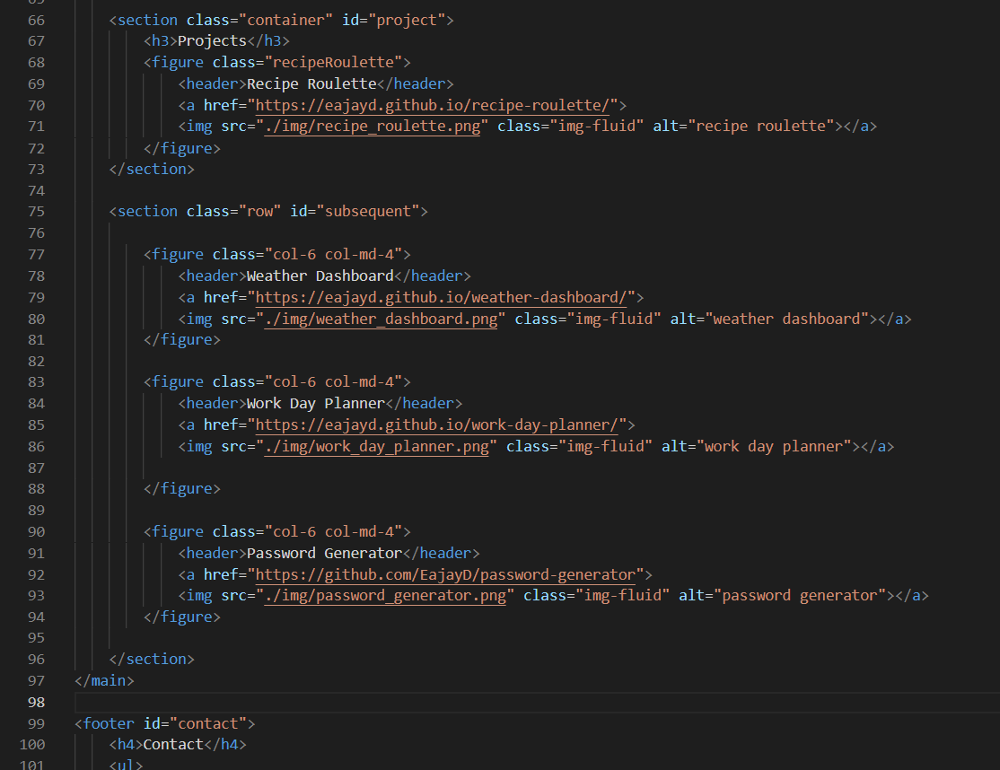

# portfolio-upgrade
Portfolio upgrade from the alpha version I previously had, hence the upgraded portfolio. While still looking largely the same as the alpha version, this upgraded version had been outfitted with Bootstrap which I did not have access to prior. Using Bootstrap allows for a better responsive and mobile experience. I have also updated it with projects and assignments that I have actually worked on, so no more placeholders. 

## Getting Started

Click the deployed link below to view my portfolio!

## Built With

* [HTML](https://developer.mozilla.org/en-US/docs/Web/HTML)
* [CSS](https://developer.mozilla.org/en-US/docs/Web/CSS)
* [Git](https://git-scm.com/about)
* [Github](https://github.com/)
* [Bootstrap](https://getbootstrap.com/docs/5.0/getting-started/introduction/)

## Deployed Link

* [See Live Site - Click me!](https://eajayd.github.io/portfolio-upgrade/)

## Code Snippet

## Authors

* **Eajay Delos Santos** 

    - [Link to Github](https://github.com/EajayD)
    - [Link to LinkedIn](https://www.linkedin.com/in/eajay-delos-santos-912950214/)

